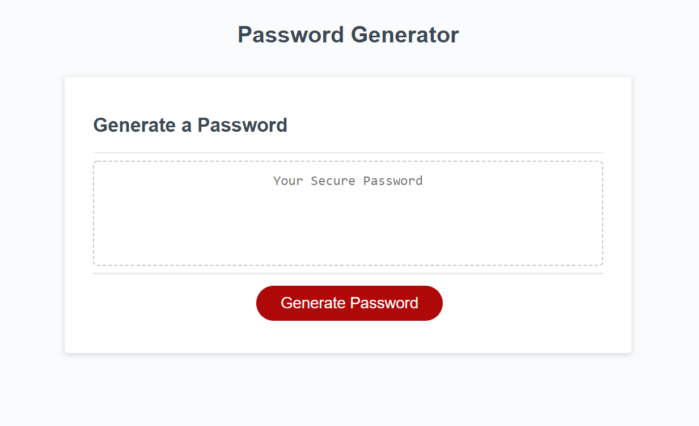

# Password-Generator

## Motivation
This project was created to provide users with an application they can use to generate a random password. The user is able to select all criteria for the password including length as well as what is to be included (lowercase letter, uppercase letters, numbers, and special characters).

 
## Screenshots

## Features
The user is able to select any length for their password between 8 and 128 characters. 

## Installation
Clone the repo from this github page: https://github.com/liambambery23/Password-Generator

## How to use?
* Open the application
* Click Generate button
* A prompt will open asking how many characters you want your password to be
* Work through the remaining prompts to tell the application which kinds of characters you want included
* Your password will be genereated in the text area on the screen

## Credits
Vivian Toung Nguyen: Trilogy Education Tutor

